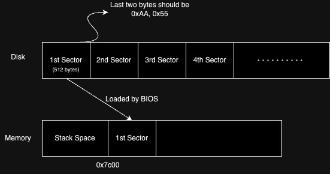
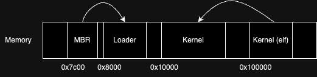

# LaiohOS
LaiohOS is a simple OS implementation that is used to enhance my understanding of OS concepts. The following passage explains how I implemented it.

## In MBR

At first, the operating system is stored on disk. When a computer is turned on, BIOS checks the last two bytes of the MBR (the first sector) on disk.

If they are 0xAA, 0x55, BIOS then loads the MBR to memory address 0x7c00.

After loading has completed, BIOS then jumps to 0x7c00 to execute the following instructions.

MBR (the first sector) contains only 512 bytes so it cannot do too many things. Therefore, we use it to load a "loader", and the loader would complete more complicated tasks, such as dectecting the memory, entering the protected mode, loading the kernel, etc.

MBR just simply loads the loader, and then it jumps to the memory address 0x8000, which is the starting address of the loader.

Q: Why does BIOS check if the last two bytes are 0x55, 0xAA?

A: 0x55, 0xAA indicates that the code is valid so that BIOS can proceed to load the code.

Q: What is protected mode?

A: Protected mode lets CPU address more than 1MB of memory, and also provides protection, preventing programs from interfering with each other.

Q: Why do intel CPUs start from real mode first, and then enter protected mode later?

A: Backward Compatibility: When CPUs with protected mode was released, there was already a significant base of software that ran in real mode. Starting in real mode ensures that older operating systems and software can still run on newer processors.

## In Loader

In loader, we complete the following tasks. First, we detect the memory so that free spaces could be used later. Second, we enter the protected mode. To enter the protected mode, we have to do several steps:

a. Clear interrupt

b. Open the A20 gate

c. Load the GDT table

d. Set CR0

e. Do a far jump to clear instruction pipeline

Third, we load the kernel elf file (using LBA method) into memory at address 0x100000.

Q: Why should we detect memory first?

A: We detect memory so that we could know which memory segments are free and could be used.

## Loading the kernel

To load the kernel, we first load the kernel elf file into memory, and then we extract the kernel from the file and put it at address 0x10000. 

After extracting the kernel code, we simply jump to address 0x10000.

Q: Why don't we just load the kernel code directly from disk? 

A: Sometimes there are spaces between sections (code, data, etc.). Therefore, the binary file could be large. If we load such a large file directly from disk, it may take a long time.

---

