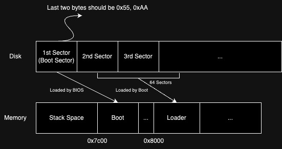

# SimpleOS
SimpleOS is an OS implementation that is used to enhance my understanding of OS concepts. The following explains how I implemented it.

## In Boot Sector

The boot sector is the first sector on disk. Its job is to load the "Loader" to memory. After a computer is turned on, BIOS then loads the boot sector to memory address 0x7c00 and starts executing the code in it.

In the boot sector, we mainly do two things:
1. Loads the "Loader"  
2. Jumps to Loader address 0x8000

Q: Why do we put 0x55, 0xAA as the last two bytes in the boot sector?    

A: 0x55, 0xAA indicates that the boot sector is valid so that BIOS can proceed to load the code.

Q: How does boot load the Loader into memory?    

A: It uses BIOS interrupt to load the Loader from disk.

## In Loader

In loader, we do the following tasks:
1. Detect free memory spaces:  
    A BIOS interrupt is used to detect free memory spaces. The memory information is then passed to the Kernel for further usage.  

2. Enter the protected mode:  
    There are four steps to enter the protected mode.  
    a. Clear Interrupt  
    b. Open the A20 gate  
    c. Load GDT Table  
    d. Do a far jump (far jump is used to clear the pipelined instructions). 

3. Load the Kernel  
    We first load the elf file of Kernel to address 0x100000, and after that the code is extracted from the elf file and put at 0x10000.

Q: What is protected mode?    

A: Protected mode lets CPU access memory address higher than 1MB, and also provides protection, preventing programs from interfering with each other.

Q: Why do intel CPUs start from real mode first, and then enter protected mode later?    

A: Backward Compatibility. When CPUs with protected mode was released, there was already a significant base of software that ran in real mode. Starting in real mode ensures that older operating systems and software can still run on newer processors.

Q: Why don't we just load the kernel directly from disk?    

A: Sometimes there are spaces between sections (code, data, etc.). Therefore, the binary file could be large. If we load such a large file directly from disk, it may take a long time.

---

